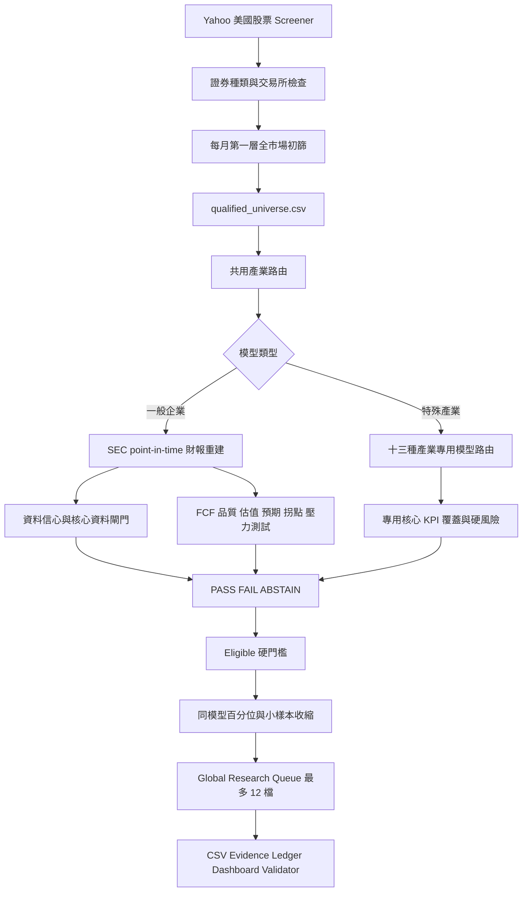

# 股票篩選策略完整邏輯（供外部 AI 審查）

> 版本基準：本機 `codex/metric-integrity-audit-v2`，以 commit `3d82252` 為修正前基準；本文件已同步 2026-07 的決策語義與跨模型排序修正。
> 本文件描述「程式目前真的會做什麼」，不是理想藍圖，也不是投資建議。
> 金額若無特別註明，以十億美元（USD B）處理；百分比欄位以程式輸出的百分點表示。

## 1. 系統目標與邊界

本系統是一套只做多的研究漏斗，不是自動交易器：

1. 每月建立一次美股大型股候選宇宙。
2. 每週四美股盤後以最新候選宇宙執行 SEC point-in-time 深篩。
3. 一般企業與特殊產業分流，不把銀行、保險、REIT 等硬塞進同一套 FCF/EBITDA 模型。
4. 先用資料完整度、財務存續與硬性風險淘汰，再以同模型百分位建立研究順序。
5. 最多輸出 12 檔 `Global_Research_Queue`，供人工研究，不直接下單；另輸出每個模型內的研究名單。

程式目前不等於完整無偏回測，也沒有自動完成：

- 歷史成分股、下市股與當時可投資 universe 重建。
- 交易成本、稅、滑價、成交衝擊與再平衡模擬。
- 預測資料、法說逐字稿、供應鏈、監管表單與公司自訂 KPI 的完整 point-in-time 歷史。
- 組合最佳化、相關性／共變異數、現有持倉與 ETF 穿透重疊計算。
- 自動買進、賣出或券商連線。

## 2. 端到端流程

## 3. 資料來源與 point-in-time 規則

### 3.1 Yahoo Finance

Yahoo 用於：

- 初始美股候選、價格、市值、成交量、sector、industry 與 quote type。
- 第一層低成本財務初篩。
- Mode C 當日價格、30 日平均成交金額、動能等市場欄位。
- SEC 無法建立總負債時的明確 `totalDebt` fallback。
- SEC SBC 或股數不足時的有限 fallback，但會扣資料信心。
- Short interest 與 days to cover 風險旗標；此來源不被視為權威空單資料。

Yahoo 當前 metadata 不得被當成歷史時點基本面，因此目前的 ledger 只解決 SEC 財報證據的 point-in-time，不代表整個策略已可無偏回測。

### 3.2 SEC EDGAR

主要使用 Company Facts 與 Submissions：

- Company Facts 提供 XBRL facts。
- Submissions 提供 accession、filing date、acceptance time 與表單資訊。
- 每個 fact 必須滿足 `available_to_model_at <= decision_timestamp`。
- acceptance time 缺失時，保守使用 filing date 次日，並降低資料信心。
- 國內公司核心 fact 最長可舊 240 天。
- 20-F／40-F 外國年度申報最長可舊 550 天。
- 非美元或無可靠 IFRS 映射時不得把數值假裝成美元，維持 `ABSTAIN`。

### 3.3 TTM 計算順序

程式明確禁止把單季乘四年化。流量型指標依序採用：

1. 若最新年報期末不早於最新季報：直接用最新完整年報。
2. 有最新季報及可比較 YTD 時：

   `TTM = 最近完整年報 + 本期 YTD - 去年同期 YTD`

3. 若上式無法成立：由 Q1、Q2-Q1、Q3-Q2、FY-Q3 重建單季，合計最近四季。
4. 仍無法建立時：退回最近年報，標記 annual fallback 並扣資料信心。
5. 核心 TTM 仍缺失、過舊或沒有 evidence lineage 時：`ABSTAIN`。

### 3.4 證據帳本

每個實際使用的來源或衍生值記錄：

- ticker、CIK、concept、form、period end、filed／accepted／available time。
- accession、單位、原始值、選用角色。
- 衍生公式與 source evidence IDs。
- 衍生圖必須無循環，且不得引用決策時間之後的 evidence。

## 4. 每月第一層全市場初篩

入口：`total_market_hunter_v2.py`

### 4.1 候選來源與證券種類

- Yahoo 美國區股票 screener。
- 市值先限制至少 50 億美元。
- 每頁 250 檔，最多 20 頁。
- 支援 NASDAQ、NYSE、NYSE American 等指定交易所代碼。
- 只保留普通股或有足夠證據推定為普通股的 ADS。
- 排除 ETF、基金、preferred、unit、right、warrant、note、bond 等非普通股。
- symbol 主要格式為 1 至 6 個英文字母，可帶一組 `-` 或 `.` 股類尾碼。
- 同一 CIK 多個普通股類別時，優先官方普通股證據完整者，再選平均日成交金額較高者。
- 已明確處理 FOX/FOXA、GOOG/GOOGL、NWS/NWSA、UA/UAA 等雙股類重複。

ADS/ADR 模糊時會用 SEC 年報 cover page 的 `Security12bTitle` 與 `TradingSymbol` 交叉確認；無法確認則 `Review`，不硬猜。

### 4.2 共通前置條件

- 市值 `< 5B`：淘汰。
- 市值缺失：`Review`。
- sector 或 industry 缺失：`Review`。
- 不支援交易所、非股票或基金：淘汰。

### 4.3 一般企業初篩

- 最近一年 OCF `<= 0`：淘汰；缺值則後送 SEC。
- 毛利率 `<= 0%`：淘汰；缺值則後送 SEC。
- 毛利率 `< 25%`：執行同業檢查，但不直接淘汰。
- 同業樣本至少 5 家才計中位數；樣本不足或低於中位數只警示。
- EBITDA `<= 0`：淘汰；缺值則後送 SEC。
- Revenue `<= 0`：淘汰；缺值則後送 SEC。
- 有可靠 cash 時：`Net Debt / EBITDA`。
- cash 缺失時：保守用 `Gross Debt / EBITDA`。
- 槓桿 `> 5x`：淘汰。
- 槓桿 `> 4x` 且 `<= 5x`：警示，但可後送。

目前預設關閉：

- PP&E／Revenue 上限篩選。
- 機構持股至少 40% 篩選。
- sector 黑名單與 industry 黑名單。

### 4.4 特殊產業的 Yahoo 初篩

第一層只排除極明確風險，SEC 專用模型才是權威：

- 銀行、放款金融、P&C、壽險：book value `<= 0` 或 ROE `<= -20%` 淘汰。
- Equity REIT：已揭露 FFO `<= 0` 淘汰；缺 FFO 則後送 SEC 重建。
- Mortgage REIT：book value `<= 0` 淘汰。
- Regulated Utility：EBITDA 與 OCF 同時 `<= 0` 淘汰。
- Fee Financial：EBITDA 與 OCF 同時 `<= 0` 淘汰。
- Cyclical：EBITDA 或 OCF 非正只警示，交由 trough survival 模型判斷。

### 4.5 初篩輸出與容錯

- `qualified_universe.csv`：完整跑完才更新。
- `hunter_audit.csv`：保留 Pass、Drop、Review 與原因。
- 中斷只更新 partial/checkpoint，不覆蓋上次完整 universe。
- Yahoo 限流時可沿用最近完整 hunter 驗證過的證券種類、交易所與產業 metadata。
- 舊 cache 不得拿來猜價格、SBC、負債或核心財報數字。

## 5. 共用產業路由

入口：`mode_c_routing.py`

路由順序概念如下：

- 保險經紀：`FINANCIAL_FEE`。
- 保險、healthcare plan、managed care：依關鍵字分到 `INSURANCE_LIFE` 或 `INSURANCE_P_AND_C`。
- 金融 sector：
  - bank／savings：`BANK`。
  - mortgage finance、consumer finance、specialty finance、credit union：`FINANCIAL_LENDER`。
  - 其餘：`FINANCIAL_FEE`。
- REIT：分 `REIT_EQUITY` 與 `REIT_MORTGAGE`。
- Utilities：merchant／renewable／independent power 走 `GENERAL_CORPORATE`，其餘走 `REGULATED_UTILITY`。
- Energy、Basic Materials，或油氣、金屬、煤、化學、木材、紙、航運、航空、卡車、汽車、農業等關鍵字：`CYCLICAL_MIDCYCLE`。
- 其餘：`GENERAL_CORPORATE`。

`FINANCIAL_FEE` 若 SEC 顯示 loans/assets `>= 20%` 且存在信用損失準備，可透明改路由為 `FINANCIAL_LENDER`。輸出保留初始模型、最終模型與改路由原因。

## 6. Mode C 共通前置閘門

入口：`AQR_ModeC_Agent_V12.py`

- 市值至少 50 億美元。
- 30 日平均成交金額至少 1,500 萬美元。
- 必須是支援交易所的普通股。
- sector／industry 不可缺失。
- 價格、市值、流動性或證券種類明確不合格：`FAIL`。
- 核心 SEC 資料缺失、過舊、幣別不可靠或 lineage 不足：`ABSTAIN`。
- 一般企業所需核心 facts：OCF、Revenue、EBIT、CapEx、D&A、Gross Profit、Net Income、Cash、Equity。
- 一般企業核心 TTM：OCF、CapEx、EBIT、D&A、Revenue、Net Income。
- SBC 不可在缺失時默認為 0。
- 總負債 SEC 優先；Yahoo `totalDebt` 只可作明確 fallback。
- cash、equity 必須有可用的 SEC balance-sheet evidence。
- EV `<= 0` 時一般 EV-based 模型不再可比，改為 `ABSTAIN` 交由淨現金特殊情境研究。

## 7. 一般企業 Maintenance CapEx 與 FCF

### 7.1 D&A 錨點

若資料可得：

`D&A Anchor = max(TTM D&A, 最近三年平均年度 D&A)`

若三年 D&A 不完整，仍可用 TTM D&A，但信心較低。

### 7.2 Maintenance CapEx 估計

先定義：

`Base = min(Total CapEx, D&A Anchor)`

`Excess = max(Total CapEx - Base, 0)`

再依營收成長決定 Excess 中被視為維護性支出的比例：

| TTM Revenue Growth | Maintenance Ratio of Excess |
|---|---:|
| `<= 0%` | 80% |
| `>= 15%` | 20% |
| `>= 5%` 且 `< 15%` | 35% |
| 其餘或缺失 | 55% |

`Maintenance CapEx = min(Total CapEx, Base + Excess * Ratio)`

敏感度區間使用 Ratio 上下 15 個百分點。完全沒有 D&A 時用全部 CapEx，且 Maintenance CapEx 信心為 `LOW`；`LOW` 會使一般企業 `ABSTAIN`。

### 7.3 FCF 公式

- `Maintenance Real FCF = TTM OCF - Maintenance CapEx - TTM SBC`
- `Conservative Real FCF = TTM OCF - Total CapEx - TTM SBC`
- `Real FCF Yield = Maintenance Real FCF / Market Cap`
- 同時保留兩種 FCF 對 Market Cap 與 EV 的 yield，避免分母混用。

主要資格門檻使用 Maintenance Real FCF／Market Cap，保守版本用於敏感度與風險檢查。

### 7.4 CapEx 風險旗標

- Revenue growth `<= 0` 且 `CapEx / D&A >= 1.5`：`growth capex trap`，直接 `FAIL`。
- Revenue 下滑且 `CapEx < 60% * D&A`：標記 underinvestment high-yield 警示。
- Maintenance Real FCF `<= 0`：直接 `FAIL`。

### 7.5 FCF 歷史品質

- 最多取最近 5 個連續年度。
- 每年必須同時有 OCF、CapEx、SBC、Revenue、Net Income lineage；SBC 缺失不能當 0。
- 至少有 3 年時，Real FCF 為正的年度比例必須 `>= 60%`。
- 有 3 年完整資料時，三年累計 OCF 必須 `> 0`。
- FCF margin 標準差用於穩定性評分。
- 每股 FCF／EPS 三年 CAGR 只在精確三年端點與拆股調整股數可得時建立。

## 8. 一般企業資產品質與償債能力

### 8.1 ROIC／ROCE

- `Tax Rate = TTM Tax / (Net Income + Tax)`，限制在 0% 至 35%。
- 無法建立時假設 21%，並扣資料信心。
- `Invested Capital = Equity + Debt - Cash`
- `Average Invested Capital = (Beginning Invested Capital + Ending Invested Capital) / 2`
- `ROIC = EBIT * (1 - Tax Rate) / Average Invested Capital`
- 缺期初資本時才回退期末資本，標記 `ENDING_CAPITAL_FALLBACK_ESTIMATED` 並扣資料信心。
- 同時輸出期末資本 ROIC，以及含／不含 goodwill 的 ROIC，供口徑勾稽。
- `ROCE = EBIT / Invested Capital`

### 8.2 ICR

- 一般情況：`ICR = EBIT / Interest Expense`。
- Debt 很小（`<= 0.01B`）或 Cash `>= Debt`：ICR 視為 non-binding／無限大。
- 有淨負債且缺 Interest evidence：`ABSTAIN`。
- 最終 eligible 需要 ICR `>= 3x`，除非 ICR non-binding。
- ICR `< 1x`：一般企業直接 `FAIL`。

### 8.3 EBITDA 15%／30% 壓力測試

假設 D&A 固定：

- `Stressed EBITDA = EBITDA * (1 - Drop)`
- `Stressed EBIT = EBIT - (EBITDA - Stressed EBITDA)`
- `Stressed Real FCF = Real FCF - EBITDA Loss * (1 - Tax Rate)`
- 重算 ICR 與 Net Debt／Stressed EBITDA。

Survival 必須同時滿足：

- Stressed EBITDA `> 0`。
- Stressed Real FCF `>= 0`；淨現金公司可允許一年負 FCF，但剩餘現金必須仍為正。
- 有淨負債者 stressed ICR `>= 1.5x`。

30% 情境 survival 失敗不得列入 eligible。

## 9. 一般企業歷史估值與反向估值

### 9.1 歷史估值

- 僅在 filing inputs 已可被市場取得後再重建該年估值，另加一日保守 lag。
- 股數與價格先調整到一致拆股基準。
- 用當時 debt、cash、EBITDA 重建 Market Cap 與 EV/EBITDA。
- 至少 5 個正值 EV/EBITDA 年，且可用年度覆蓋率 `>= 60%` 才有效。
- 主要 value 因子使用目前 EV/EBITDA 在自身歷史中的 percentile。
- 下檔估值依有效樣本數使用 P25（5–6 年）、P20（7–9 年）、P15（10–14 年）或 P10（15 年以上）；不足時採保守 fallback floor。
- 30% 財務壓力下的估值回撤必須大於 `-75%` 才可 eligible。

### 9.2 反推三年 EBITDA CAGR

- 必要報酬率：10%。
- `Future EV Required = Current EV * (1.10)^3`
- `Required EBITDA in Year 3 = Future EV Required / Target Exit Multiple`
- Target multiple 使用 40% 公司歷史中位數、40% 同業／同模型中位數、20% 利率調整值；缺同業或利率資料時使用明確的保守 fallback，不補 0。
- 再由目前 EBITDA 反推三年 CAGR。

### 9.3 動態 CAGR 容忍上限

基礎上限為 30%，再依 ROIC 與近三季毛利變化調整：

- `ROIC Adjustment = clamp((ROIC% - 15) * 0.6, -6, +10)`
- `GM Adjustment = clamp(GM Change pp * 2, -15, +6)`
- `Limit = clamp(30 + ROIC Adjustment + GM Adjustment, 15, 45)`
- 毛利三季變化 `<= -2pp` 時，上限封頂 15%。

預期負擔分數：

- Implied CAGR 在 `-10%` 至 `15%`：100 分。
- 低於 `-10%`：35 分。
- `15%` 至動態上限：由 100 線性降到 55。
- 超過動態上限後，再於 15 個百分點內由 55 線性降到 0。
- 缺失：20 分，但最終 eligible 仍要求 implied CAGR 有效。
- 最終 eligible 要求 expectations score `>= 15`。

## 10. 一般企業營運拐點與博弈風險

### 10.1 近三季營收與毛利

- Revenue `< -2%` 且毛利變化絕對值 `<= 1.5pp`：暫時落難好公司，trend score 85。
- Revenue `>= -2%` 且營收連續下降，或毛利變化 `<= -2pp`：結構性風險，trend score 0。
- Revenue `< -2%` 且毛利變化 `< -2pp`：雙重惡化，直接 `FAIL`。
- 其他：中性，trend score 70。
- 季度資料不足：`ABSTAIN`，不得把不可判斷誤寫成基本面失敗。

### 10.2 DSI

`DSI = Average Inventory / Trailing 4Q COGS * 365`

Average Inventory 使用當期與約一年前（300 至 450 天）的存貨平均：

- 三個觀察點連續下降，且 YoY `<= -5%`：去庫存改善，80 分。
- 三個觀察點連續上升，且 YoY `>= 5%`：庫存惡化，20 分並扣 8 分風險。
- 連續下降但未通過 YoY 季節性確認：60 分。
- 只有有效且適用的庫存資料才計分；缺失為 `MISSING`，不適用為 `NOT_�]�����k�w�����>��ɕ���ɥ�����ɹ���ώ(+�b��������{��i��ե�佅�͕�̀Ԕ��̀�ԗ���͕�̽��ե�������̀����>7�BG�I=�����̀�ԗ���٥�����ɕ���ɥ�����ɹ���̀������̀�����>7�BG�@��ĸ����̀������>7�BG�9%$��ɽ�Ѡ�������̀����((�����Ը؁IU1Q}UQ%1%Qd(+�����2��g��i	%P���ѕɕ�Ё��ٕɅ������н����х��=
�
���I=���ɹ���̽��٥�����A@���ɽ�ѣ�()!�ɐ������ɕϾ�h((���ե�䁀�����(��%
H����ĸ�჎(����н����х������ԕ��(��=
�������(��9�Ё�������������(+��+�7��i%
H��ԗ�����х�����Ս��ɔ�����
�����չ���������I=��ԗ�A@���ɽ�Ѡ�������٥�������ٕɅ��������>��D�
������떒ǚf�>��R�����ф�A@��������B�⛢�����(+�b��������{��i%
H�ĸ����̀�����н����х���Ԕ��̀�����>7�BG�=
�
����������̀ĸ��I=�̔��̀�ȗ�A@���ɽ�Ѡ�����̀�����ɹ���̽��٥�����������̀ĸ��((�����Ը܁
e
1%
1}5%
e
1(+�ϖ�G�r���ԃ�,�����е���ѥ�����Ӗꘁ	%Q��h((��5����危���k��ߖ>˒ⷒ�7�V�(��Qɽ՝���i@�Î(��A�����i@�Î()!�ɐ������ɕϾ�h((��5����危��	%Q�������(���r'�ޣ�ʃ�
ג�P����ɕ�Ё	%Q�������(���r'�ޣ�ʃ�
ג�P��ɽ՝��	%Q�������(���v{�ޣ�>��G�f��ɽ՝��%
H����ĸ��჎(��9�Ё���Ӿ�=�ɽ՝��	%Q�����჎(+��+�7��iX������危��	%Q������ɽ՝��%
H��ԗ��ɽ՝����ٕɅ�������I����
�X��ԗ��危����ͥѥ�������(+�b��������{��iX������危��	%Q������̀����>7�BG��ɽ՝��%
H�ĸ�����̀����Ё���н�ɽ՝��	%Q�����̀����>7�BG�I����
�X�����̀������ɕ�н�����危��	%Q�ĸ����̀������>7�BG��o�ޣ�>��G���>�j��ɽ՝��%
H���C�"�V�nӚ:��
���Î((�����Ը��%99
%1}19H(+�����2��g��iх���������ե�佅�͕�ώI=Q
�����݅��������ώ9%$��ɽ�ѣ�@�Q	[�()!�ɐ������ɕϾ�h((��Q����������ե�佅�͕�́���ԕ��(��9�Ё�������������(+��+�7��i����х������I=Q
��ԗ�����݅�����ԗ�9%$��ɽ�Ѡ��ԗ�م�Յѥ����ԗ�(+�b��������{��iх���������ե�佅�͕�̀Ԕ��̀�ԗ�I=Q
�����̀��������݅��������̀��Ԕ��̀ȸԗ�9%$��ɽ�Ѡ�������̀����@�Q	X�ȸ����̀������>7�BG�((�����Ը�%99
%1}(+�����2��g��i	%P�ɕٕ�՗�I=Q
�=
���Ё���������Ё���н	%Q�ɕٕ�Ք��ɽ�ѣ�=
�奕���х�����������х��()!�ɐ������ɕϾ�h((��Q����������ե�䁀�����(��9�Ё�������������(��=
�������(+��+�7��i���Ʌѥ�����ɝ����ԗ�I=Q
�������͠����ٕ�ͥ�������ɕٕ�Ք��ɽ�Ѡ��ԗ���������͡��Ѐ����=
�奕�������(+�b��������{��i���Ʌѥ�����ɝ���Ԕ��̀�ԗ�I=Q
�����̀�ԗ�=
���Ё�������������̀ĸ��ɕٕ�Ք��ɽ�Ѡ��Ԕ��̀�ԗ���Ё���н	%Q�����̀����>7�BG�=
�奕���Ȕ��̀����((�����Ը�ÊL�Ը�̃���R�����B�"��((���1QI9Q%Y}MMQ}59I���i	c�IO�=]3�QA�--H���{��o�����
�I����������Ё����ɕٕ�՗�������她��U7�U4��ɽ�ѣ���ɵ����Ё����х��������ͅѥ���ɕٕ�՗�(���QI%Q%=91}MMQ}59I���i5�Y
QH���{��o�����
聵��������Ё����ɕٕ�՗�U7��ɝ�������Ё����ώU4��ɽ�ѣ�������ͅѥ���ɕٕ�՗�(���%9MUI9
}1%9-}MMQ}59I���i	4���{��o�����
�I�����Ʌ������͕�ώ��ɵ����Ё����х��������她��U4��"�"C�r�����/�(���=Q!I}}%99
%1���k����W������+��Ò�'�z/�j���R��z/�G�z7��o����R�����w�� �ɕ�եɕ��-A'�(+���>�����-A$��.��������е���ѥ�������C��3����/�ڷ�2��5%MM%9���o��#�R�����z/�>���	MQ%9���"[�f7��8���ٕɅ����3��7��_�.��
Ϟ�Ǣ��R�����B���ɝ�����C��/�n��>���{���R�����B���>㢎s��((����ظ��&皺+�R�����n��&7��7�r���ޗ��s�~�(+��/��?��7�r�R���g��X�
���������̃���w�>[��_��/�"_�v{��g��X�-A'��h((���*��3��k������
Pǎչ����ɕ������ͥ�ώ�n������O�*o�Ⳣ���(����w�j���i�х��ѽ��I	���3�VЁɕ͕�ٔ��ɥ������(���ե��I%S��iͅ����ѽɔ�9='�������������>�����<��ɥ����(��5��ѝ����I%S��iɕ���ɥ�����ɹ���ώ��Ё��ɕ���ɕ������ɍ�ӎ��Ʌѥ�����Î(��Uѥ�����i����ݕ��I=������<�Ʌє���͗�ɕ�ձ�ѽ�䁱���(���͕Ё���������Ӿ�iI�U7��=������她��U7�����ώ�������ɵ����Ё����х������Ʌ������͕�̃�"���>㖺k�����Ö�/�:��()@����˖�3�"@�5�����=5���Ʌї��=M�ٕɔ���#�R���O�*o�Ⳣ����o�ے�[�&皺+�R�����j��#�R���O�*o�NӖ��k�r���3�VӞ�/��?�2[��3�r��g�
����������?�r������s��S��7��_�"C�
�Mх�ѕȁ
������ї�((����ܸ��2��g�.�/��G��(+���>���i�����}�}���ɥ�}����Ʌ�й��(+���Ǟ.�/��h((���Y1%���k�r'�V#��S�r'����C��'�Nk�(���MQ%5Q���k�r'�>����������?�j��â�#��(���5%MM%9���k�����Zg�(���9=Q}AA1%
	1���k��˞R������7���R��(���	MQ%9���k�����Zg��˖�Ǧ~���랶[�(���MQ1���k���Zg�;�"+�(���%9Y1%���k��"[����C��7�B#��W�(+��?�&��h((���5%MM%9�9=Q}AA1%
	1�	MQ%8�MQ1�%9Y1%����7�>��Rs��ۚV��(���7���2��g�j�V���������#�r$��٥�������"[����?��3��7���*(��ձ����'�"@�Î(�����"�������"�B�&皺+�R�����r'��7�B0�ɕ�եɕ����������������ɥ���n�B#�(��5���ѕ������
�����O�*o�Ⳣ���"�ɕٕ�͔�م�Յѥ�����'��7�R��>���g�
聁MQ%5Q��(���͡���ɐ��ڣ�.���Ǣ�#�>�����R���Y1%���3��7�*(��MQ%5Q����ߖ������S�ڣ�.��((����ฃ���Zg������Zc�Z(+���"���������ф��������������x������Z/��/��3���&��"��h((�����͕���ѕ���٥�������i���Ճ�(�������х������ٕɅ�����������i���Ճ��m��������i���Ճ�(����ɥ�����������k��?�,��������3�r��h�������(�����������������Ѓ��S��/�;��c��i��Հ��"X�������(�����Յ������������k��?�,��������3�r��h�������(���Յ�ѕȁ����������k��?�,���̓��3�r��h����Ճ�(������Ӣ
��V��떒Ǿ�i��Ճ��o��'��Ӟ�떒Ǿ�i��჎(��I=%���떒Ǿ�i���Ճ�(����ߖ>˒�Ö���V#��i���Ճ�(��	%Q��.�����޻�Vâ��8�ԗ��i������(��M	�����R��vx�M�����������i������(��M��ɕ̃����R��vx�M�����������i������(����Ѓ����R��e���������������k�ޣ�>��D��������3�r'�ޣ�ʃ�
ԁ������(�����:����R���Ĕ�������i��Ճ�(��%�ѕɕ�Ѓ����R����͠���ѕɕ�Ё�ɽ���i������(���.�
���3�
��V��7�r'�7�����7����3��i������(+�����������������,��	MQ%9���3��7�v���c�"��s�VG�((����丁������I�͕�ɍ��EՕՔ��"���B#�R���X((���>���x�����������Q�Օ���ⷦ�(�����"�������I�܁M��ɔ�����R���1���}Q�ɵ}M��ɕ���3�&皺+�R��������R���%�������}5����}M��ɕ���mI�܁M��ɔ��>���o����z/�������#�(���]�ѡ��}5����}A�ɍ��ѥ�����>��r��n�B3�r����%�������}5����}-�倃����#��_�(����?����r��R۞⻖���?��i��������������������ɍ��ѥ��������(�����B��S��ۦ���?����R���M��չ�}]�ѡ��}5����}A�ɍ��ѥ�����3�7���Zg������"�ѥ���ȃ���.w��o��7��_�R��ޣ����z,�I�܁M��ɔ��:K�B7�(���
ɽ��}5����}
����Ʌѥ��}Mх��̀�U9
1%	IQ���3����z/���f��"��7��7����ޣ����z/��C�r��Ǧ���˚����[�(���r��h��ȃ��S�(����/��?�ⷞj�͕�ѽȃ��S�V㞆���+�fC��˖s�R���!�5a}AI}M
Q=H������'�(���"�V������̀���i݅э���=ɕ͕�ɍ���������ї�(������̀�Ӿ�i�ɥ�ɥ��ɕ͕�ɍ���3��7��뢶ÞnӚ:����'�(���ԃ�̀�������+��7��w�Vg�:����z/�Z����3������#�>���[�k�;���ޔ�-A'���#�R���O�*o��ޣ����z/�����[�"���B#���7��3�&7���"C�
聁MQIQI}
9%Q��(���n��&4��A=IQ=1%=}%Q}A9%9�Q�Օ����S�ޣ����z/��7�r������[��3�n������S��ے��"_��7�r���.W�6��k�
�>����'�.�/�(+�*W���R���[�3�v{�n��&7��3�VӢ��.W�r��ϖ2[��h((��EED�����Y=<��������.W�/�
������̀����(�����.W�2�
��k�������̀�ȃ��S�(���Z��
��r��h�̗�(���Z������.W�R�����r��h�䗎(��EEG��=Y=<��&7�6����.�����7��[���.W�*�����3�R���[�����ϖ�D�����"�(+�n��&7��/��?��K�r'��3�VӢ��.W���>X�Q��r�ZÚ2�
��"�>��r'�*W�����B#��3�&�Q�ѽ������7�Z+�����jo�Z��
��̗�͕�ѽȀ䔃��7�b����ޗ��/�Z��&7����~���3��7�'�����ǖ�˞RǞ�S��ے��"_���.W�~ߢ�3�((��������͡���ɐ��j��c�"����k�"��S��۞�k�҈()�͡���ɐ�����랆��ޣ���S��ے�閭3��3��/����h((��$��f۞&�(�����Zg�ⷖ��n�*o�"�V��ǎ(���n��2[��?�n��ˎ(��$�����S��?����'�(�����f�b˞���(+�g��o��g�Ɠ�>��R��Z�S��ۖ"����3��7�b��
����������������w��ێ(+�ڣ�.�������r��;����r���i͕�ѽȀ׎��������ώѡ�������Ȁ˾�o�����S����7�ϖ�D�������ٕɅ����&7����������k��+�f����R���ϖv�R۞⻖�3����z/���f��"��7�����������=�ՕՔ��V�?����Zg������-A$���ٕɅ����"�>��R���/��+�2[��3��7�ޣ����z,�I�܁M��ɔ���랮/����>������z/�&#�r��R確+�f�7�����ɕ�����͕�����((����ĸ�Y�����ѽȃ�j��7�>���+��w���(+���>���i�م����ѕ}����}�}������̹��(+��?������~ߢ�3��3����~���h((���2��g�.�/�"��յ�ɥ��م�Ք��b��B����ӎ(��AMO��=%3��=	MQ%8��"�:�n��b��B����ӎ(�����������b��B��r�j�k�;�&�r'����Z���(����Ѓ����ێ5�ɭ�Ё
�þ�=[�
�奕�����ɕ�̃�"�>7�BG��Ö����?�b��B��>��7��_�(���
��V�.�
��"��7����3�fW�B�b��B����ӎ(���R�����޿�RǢ"����ѥ���ɕ�������������b��B����ӎ(���&皺+����z,�ɕ�եɕ�����ɥ����ٕɅ���������������b��B����ӎ(��
��?��Ö�ߖ>˚b��B��S�r��;�����(��٥�����������ȃ�b��B������е���ѥ������r�����٥������������JÎ(���7������b��B��r'��'�Nk��1���م���}�ɽ������#�
�Î(��������I�͕�ɍ��EՕՔ��b��B���'�Z������������
�����2'�R۞⻖�3����z/���f��"��7�:K��?�j�&4��ȃ�B7��3��P�I�܁M��ɔ��r�����Vۚ"C�ޣ����z/�:K�B7����C�(��M$��9=Q}AA1%
	1���b��B���w�2��ձ���n���C��+�7�b��B������?�2[�(��@���ɽ���?���>�>���G���O�*o�.�/�Mх�ѕȁ��є��b��B����ӎ(�����/�b��B��>��r����/��W�"�Ɠ�&��"��3��ߖ>˒�Ö���Յ�ѥ����b��B�����B#����r��V�(���͡���ɐ��"�
M[��=)M=8���C�zs�b��B����ӎ(+������7�>���+��w��ۖ�ǚV_��1��!Ո��ѥ��̃��7�f�����͡���ɓ�((����ȸ���!Ո��ѥ��̃�:K��,(+���>���i����ѡՈ�ݽɭ����̽�����}�չй嵱�((����?�ǖnl�������UQ��k��;�
��ǖno�n���3��3�>Þ��f�ZO�ǒ�P�����þ�3����R��r��G��3�VЁ��Յ������}չ�ٕ�͔���ـ���D�5�����(����?�r �ă�^��������UQ��k�7��G������Ё�չѕ˾�3�7��D�5�����(���>��&/�.T������э���3�⛦�N�b��B��#��D��չѕˎ(��AH��>���D����������Ⳣ���"�N�Ϋ����~���3��7��G�b��Ӗ�����Ӛ*O�>[�(���r#�ꘁ�չѕȃ�ⷦS��ǚV_�f��w�Vg��+�����3�VЁչ�ٕ�͗��3��7�R�����ѥ������N/�(���"C�*��3����
M[�)M=;��٥�������Ց�ӎ��͡���ɐ���ѥ����Ͼ�o����B �A���̃��w��ۚ&7����˞�˞�g�((����̸���뢶Ö>����,�$����#�R�N+�j�V?��0(+��/��7�b���ˢ�'�����՟��3�3�b��r���_�k��Ӗ�{������~��j������h((ĸ�5���ѕ������
�����j�����ɕٕ�Ք��ɽ�Ѡ��V�f��?��3���B��ޠ�ͽ��݅ɗ�͕������Սѽˎѕ������������ɥ����"���������䃖��>���Ӛ"C��/��|(ȸ�I�ٕ�Ք���7��{��P�
��������ĸՀ�����,�%3��3�b��B��r�2����f����ߖ�W��7�r�����W��?���r��"[��k��Ӗޗ��/�R���j���>��|(̸��n��&7��˚*+���"����������ꛢ��Zg��7��ϚR�
�	MQ%;��o��/����3�Bs��/�b��B���7�r'��?��˞j����ͥ�����ф�%3�(и�@����˚r'��#�R��5�����=5���Ʌї��=M�ٕɔ���O�*o��m	9/�I%S�UQ%1%Qd���'��7�>��r'�ǖB3��/�v��"�����������ї��3�'���#��s��+�R������#�R���O�*o�(Ը��6��'����&皺+����z/�"���"��������7�7�nӚ:���ߚ:H�I�܁M��ɗ��o���R۞⻖�3����z/���f��"��7��7��7�b���L�݅������݅ɐ������[�j�ޣ����z,�������(ظ���o�"�����ԕ���j����ȁ�������n��&7����jo�>���������7��c��þ�3�b��B��
�r'��w�Vg�����?�&�j������|(ܸ�M$���˖�7�r7�.g������ϖ>Î�G�z7����Zǖz/����S�"��;�ꯖ�c����Ϋ�����>㢢��
�8���o��/�R�N+�n��&7�ꯖ�c����Ϋ���Z���b��B�������(กM���Ё��Օ�锃����/�&��"�b��B��*+��/��ۦ��.T���ͥ����"�~�r��v�����j���ߞ
�������b��B��'�>���s����j���g�Ɠ�3��7�ȁ�������"�V��|(七�>7�BG��Ö��˚R�
�������������>��B3����"�"��:��ߖB#��o��/����~��B3����z,�����������b��B���7�r�*+��7�B3�V��������?�2��7�(����I=%���˚R�R��r�"w�r�r���ϖv�*W�����r���o��/����~�����ꛖ�ϖv�"�7�����ע��^����f��{��7�>������"C�j�?�޻�(�ĸ�=
���7�>�������'��c��Ϛ�����C�Rۚ���"[���������/���G�&��n˾�o�n��&7�b��B��r���*����K�C������ɕ��ɕٕ�Ք��"���͠����ٕ�ͥ����危���"�����|(�ȸ�M	��?�
��V��?���r��7�����˖*����:�7�Ɠ�"�م����ѽ˾�o��/����~�����եͥѥ���ɕ��ѕ�����Յ������7�����.W�����c�b��B����"C������(�̸��I����
�e�������ȕ���%
H����჎����������.W�����4���'�vs�/�Z����3�b��B��'�2'�R������"��:��΋�.W�"�f���j;��ך����[��|(�и���ߖ>˒�Ö��˒�w����r��V����R��@�Խ@���@�Խ@�þ�o�ϖ�D�ԃ��Ӓ�7�r������N/��3�VӚf���ǚr�(�Ը�����R��n��&4�e�����չ�ٕ�͔��ˢ�3����W��ߖ>˚Ⳣ���r�r$����٥ٽ�͡������Ͼ�o�r���3�"@������ѕ��͕��ɥѥ�̃�"����ѽɥ��������ѥ�Օ��̃�&7��3��7�'�����ǖ�Ӗ2[����V#�(�ظ��͡���ɐ��j����ޣ����閭3�r��7�r���"C�Vc��/�?�������閭3�>��"�����>�����Ǧ~����ޗ�Σ�?�*o�(�ܸ�Q�ѽ���Î�Z��
��̗�͕�ѽȀ䔃�n��&7�b��R���[��3��7�b���3�VӞ�/��?�2[���v��o��7��[����b;����#�6�"�(�ฃ��[�r/���>�����Յ������������"����������ɕ͡���̃����7��3�b��B��r��O��7�B3�Rϖ�Ǧ��:�j���>���Zg�>���S����Ǟr��|(�丁a	I0��B3�����g�Ɠ�"���>����ѕ�ͥ����j�ޣ���>�b�����3�b��B��r'��ϖ��������ɔ����N/�ʃ�󞲛�f�ɕ�хѕ���ӎ�������є�����ώ�ȼ�̃�ǖ�Ӗꛢ"��ע��7�ޣ��|(�����"�V�Z���"��+�7��k�r����<�݅������݅ɓ���е���ͅ�����%���ɹ�ٕˎ�Ʌݑ�ݸ��"X������Ʌѥ������ٔ���_��'��3��7���>��v��ʇ�.g�nӢ�뢪7��k�r���((����и��>��nӚ:����֛�>����,�$��j����~��>C��뢦x()���ѕ��+����b����B7����k�?�2[�~�r��v���S��ے���"���Zg�ޗ��/�����#�N����/�Z��ۚb��"G�n��&7�
��������㞢/��?�j����jo�
?���3��7�b�����ך>C��#�(+��/�k��Ӗ�{������~���3����7���>��>C��nӖ�k�2��g��3����7���R�����o�j�3�r���n{�Ⳏ7��C�v���/�C����h((ĸ��&������?�2��������Zg�ҧ��?���������������ώ���٥ٽ�͡������ώ�Z���7��?����f��?�r�ZO�2������7����#�"��R�����2��7�"�%0�	MQ%8���{����2�����(ȸ��6�"�r���"C�2����r���"C��?���>���Ǧ~��:K��?��>���Ǧ~�������j�V?��3�(̸��&�"�����~��QQ7�5���ѕ������
���M	�I=%���ߖ>ȁX�	%Q��>7�:��
K�M'����/�"��O�*o�Ⳣ���(и�����~����"�������"�6��'����&皺+�R��������z/�޿�RǞj����Z�����+�7��3�>+�R۞⻖�3��S��ۦ���?�b��B���7�r'����ǖ?�޻�(Ը���?�/�V?��3�֛���k�jӦ7�ꛎ�ߦ�S�>7��/���뢶ÚZÖ���?��?�.�/����/��&�r���Zg��r��?�Ⳣ����#��/�(ظ��������f����#�ڷ�2�����е���ѥ����i�م������}ѽ}�����}�Ѓ��7��_�fk�Z������ͥ��}ѥ���х�þ�o������Z������c�no��Ӗ2[��o��뚂����'�Nk��7��_��c��7�
�Î(ܸ����#�R�Z���Zg����������랶[��{�����R��������z/�"���B#����j���3��7���#��{�*�����v���+�j�n���C�V�?�(ฃ�r��3�֛��@��@Ľ@ȃ�����s���Z���3�>+�N���o��뢶Ör���K�r'���<�݅������݅ɐ���_��'�&7��7�'��+��k�(+��/�b;���6�"�3��/��?��˖����s�7��3�R���[���r����.W�~ߢ�3�7��3��뢶ÚZÖ�{�7��3��7���*+��'���ߖr�����ߎ)���((����Ը�����/��?��7��((���ѽх�}��ɭ��}�չѕ�}�ȹ�僾�k��?�r �չ�ٕ�͔��"������Ɠ�"w����(�������}�}ɽ�ѥ����僾�k�ǞR��R�����޿�Rǎ(�������}�}��������}�����̹�僾�k�&皺+�R�����"w����"�6��'�����#�R���Ǟ���޿�Rǎ(�������}�}ɕ͕�ɍ�}�ɥ�ɥ���僾�k����z/���f��"��7���?����r��R۞⻎��S��۞.�/�"���B��S��ے��"_�(���EI}5���
}����}X�ȹ�僾�i����е���ѥ���M����Zg����"��������W�"��R�����"���"��S��ۢ���(�������}�}�٥�������僾�k��'�Nk��Ϛr��(�������}�}���ɥ�}����Ʌ�й�僾�k�2��g�.�/�"���R����(���م����ѕ}����}�}������̹�僾�k�����7�>���+��w��ێ(����ե��}����}�}��͡���ɐ��僾�k�vs�/��S��۞�˞�g�"�����S�ڣ�.��(������ѡՈ�ݽɭ����̽�����}�չй嵱���k��?�Ǿ�?��?�r#�:K��/�"�f���(