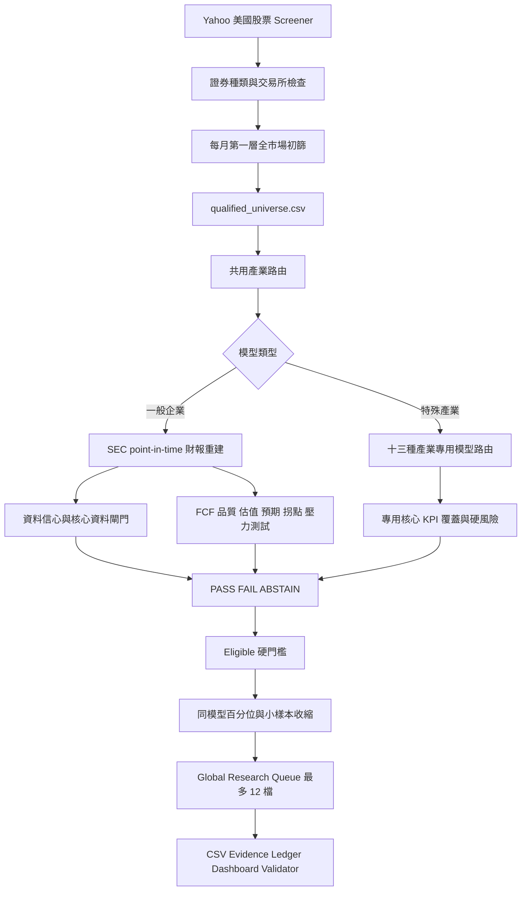

# 股票篩選策略完整邏輯（供外部 AI 審查）

> 版本基準：本機 `codex/metric-integrity-audit-v2`，以 commit `3d82252` 為修正前基準；本文件已同步 2026-07 的決策語義與跨模型排序修正。
> 本文件描述「程式目前真的會做什麼」，不是理想藍圖，也不是投資建議。
> 金額若無特別註明，以十億美元（USD B）處理；百分比欄位以程式輸出的百分點表示。

## 1. 系統目標與邊界

本系統是一套只做多的研究漏斗，不是自動交易器：

1. 每月建立一次美股大型股候選宇宙。
2. 每週四美股盤後以最新候選宇宙執行 SEC point-in-time 深篩。
3. 一般企業與特殊產業分流，不把銀行、保險、REIT 等硬塞進同一套 FCF/EBITDA 模型。
4. 先用資料完整度、財務存續與硬性風險淘汰，再以同模型百分位建立研究順序。
5. 最多輸出 12 檔 `Global_Research_Queue`，供人工研究，不直接下單；另輸出每個模型內的研究名單。

程式目前不等於完整無偏回測，也沒有自動完成：

- 歷史成分股、下市股與當時可投資 universe 重建。
- 交易成本、稅、滑價、成交衝擊與再平衡模擬。
- 預測資料、法說逐字稿、供應鏈、監管表單與公司自訂 KPI 的完整 point-in-time 歷史。
- 組合最佳化、相關性／共變異數、現有持倉與 ETF 穿透重疊計算。
- 自動買進、賣出或券商連線。

## 2. 端到端流程



## 3. 資料來源與 point-in-time 規則

### 3.1 Yahoo Finance

Yahoo 用於：

- 初始美股候選、價格、市值、成交量、sector、industry 與 quote type。
- 第一層低成本財務初篩。
- Mode C 當日價格、30 日平均成交金額、動能等市場欄位。
- SEC 無法建立總負債時的明確 `totalDebt` fallback。
- SEC SBC 或股數不足時的有限 fallback，但會扣資料信心。
- Short interest 與 days to cover 風險旗標；此來源不被視為權威空單資料。

Yahoo 當前 metadata 不得被當成歷史時點基本面，因此目前的 ledger 只解決 SEC 財報證據的 point-in-time，不代表整個策略已可無偏回測。

### 3.2 SEC EDGAR

主要使用 Company Facts 與 Submissions：

- Company Facts 提供 XBRL facts。
- Submissions 提供 accession、filing date、acceptance time 與表單資訊。
- 每個 fact 必須滿足 `available_to_model_at <= decision_timestamp`。
- acceptance time 缺失時，保守使用 filing date 次日，並降低資料信心。
- 國內公司核心 fact 最長可舊 240 天。
- 20-F／40-F 外國年度申報最長可舊 550 天。
- 非美元或無可靠 IFRS 映射時不得把數值假裝成美元，維持 `ABSTAIN`。

### 3.3 TTM 計算順序

程式明確禁止把單季乘四年化。流量型指標依序採用：

1. 若最新年報期末不早於最新季報：直接用最新完整年報。
2. 有最新季報及可比較 YTD 時：

   `TTM = 最近完整年報 + 本期 YTD - 去年同期 YTD`

3. 若上式無法成立：由 Q1、Q2-Q1、Q3-Q2、FY-Q3 重建單季，合計最近四季。
4. 仍無法建立時：退回最近年報，標記 annual fallback 並扣資料信心。
5. 核心 TTM 仍缺失、過舊或沒有 evidence lineage 時：`ABSTAIN`。

### 3.4 證據帳本

每個實際使用的來源或衍生值記錄：

- ticker、CIK、concept、form、period end、filed／accepted／available time。
- accession、單位、原始值、選用角色。
- 衍生公式與 source evidence IDs。
- 衍生圖必須無循環，且不得引用決策時間之後的 evidence。

## 4. 每月第一層全市場初篩

入口：`total_market_hunter_v2.py`

### 4.1 候選來源與證券種類

- Yahoo 美國區股票 screener。
- 市值先限制至少 50 億美元。
- 每頁 250 檔，最多 20 頁。
- 支援 NASDAQ、NYSE、NYSE American 等指定交易所代碼。
- 只保留普通股或有足夠證據推定為普通股的 ADS。
- 排除 ETF、基金、preferred、unit、right、warrant、note、bond 等非普通股。
- symbol 主要格式為 1 至 6 個英文字母，可帶一組 `-` 或 `.` 股類尾碼。
- 同一 CIK 多個普通股類別時，優先官方普通股證據完整者，再選平均日成交金額較高者。
- 已明確處理 FOX/FOXA、GOOG/GOOGL、NWS/NWSA、UA/UAA 等雙股類重複。

ADS/ADR 模糊時會用 SEC 年報 cover page 的 `Security12bTitle` 與 `TradingSymbol` 交叉確認；無法確認則 `Review`，不硬猜。

### 4.2 共通前置條件

- 市值 `< 5B`：淘汰。
- 市值缺失：`Review`。
- sector 或 industry 缺失：`Review`。
- 不支援交易所、非股票或基金：淘汰。

### 4.3 一般企業初篩

- 最近一年 OCF `<= 0`：淘汰；缺值則後送 SEC。
- 毛利率 `<= 0%`：淘汰；缺值則後送 SEC。
- 毛利率 `< 25%`：執行同業檢查，但不直接淘汰。
- 同業樣本至少 5 家才計中位數；樣本不足或低於中位數只警示。
- EBITDA `<= 0`：淘汰；缺值則後送 SEC。
- Revenue `<= 0`：淘汰；缺值則後送 SEC。
- 有可靠 cash 時：`Net Debt / EBITDA`。
- cash 缺失時：保守用 `Gross Debt / EBITDA`。
- 槓桿 `> 5x`：淘汰。
- 槓桿 `> 4x` 且 `<= 5x`：警示，但可後送。

目前預設關閉：

- PP&E／Revenue 上限篩選。
- 機構持股至少 40% 篩選。
- sector 黑名單與 industry 黑名單。

### 4.4 特殊產業的 Yahoo 初篩

第一層只排除極明確風險，SEC 專用模型才是權威：

- 銀行、放款金融、P&C、壽險：book value `<= 0` 或 ROE `<= -20%` 淘汰。
- Equity REIT：已揭露 FFO `<= 0` 淘汰；缺 FFO 則後送 SEC 重建。
- Mortgage REIT：book value `<= 0` 淘汰。
- Regulated Utility：EBITDA 與 OCF 同時 `<= 0` 淘汰。
- Fee Financial：EBITDA 與 OCF 同時 `<= 0` 淘汰。
- Cyclical：EBITDA 或 OCF 非正只警示，交由 trough survival 模型判斷。

### 4.5 初篩輸出與容錯

- `qualified_universe.csv`：完整跑完才更新。
- `hunter_audit.csv`：保留 Pass、Drop、Review 與原因。
- 中斷只更新 partial/checkpoint，不覆蓋上次完整 universe。
- Yahoo 限流時可沿用最近完整 hunter 驗證過的證券種類、交易所與產業 metadata。
- 舊 cache 不得拿來猜價格、SBC、負債或核心財報數字。

## 5. 共用產業路由

入口：`mode_c_routing.py`

路由順序概念如下：

- 保險經紀：`FINANCIAL_FEE`。
- 保險、healthcare plan、managed care：依關鍵字分到 `INSURANCE_LIFE` 或 `INSURANCE_P_AND_C`。
- 金融 sector：
  - bank／savings：`BANK`。
  - mortgage finance、consumer finance、specialty finance、credit union：`FINANCIAL_LENDER`。
  - 其餘：`FINANCIAL_FEE`。
- REIT：分 `REIT_EQUITY` 與 `REIT_MORTGAGE`。
- Utilities：merchant／renewable／independent power 走 `GENERAL_CORPORATE`，其餘走 `REGULATED_UTILITY`。
- Energy、Basic Materials，或油氣、金屬、煤、化學、木材、紙、航運、航空、卡車、汽車、農業等關鍵字：`CYCLICAL_MIDCYCLE`。
- 其餘：`GENERAL_CORPORATE`。

`FINANCIAL_FEE` 若 SEC 顯示 loans/assets `>= 20%` 且存在信用損失準備，可透明改路由為 `FINANCIAL_LENDER`。輸出保留初始模型、最終模型與改路由原因。

## 6. Mode C 共通前置閘門

入口：`AQR_ModeC_Agent_V12.py`

- 市值至少 50 億美元。
- 30 日平均成交金額至少 1,500 萬美元。
- 必須是支援交易所的普通股。
- sector／industry 不可缺失。
- 價格、市值、流動性或證券種類明確不合格：`FAIL`。
- 核心 SEC 資料缺失、過舊、幣別不可靠或 lineage 不足：`ABSTAIN`。
- 一般企業所需核心 facts：OCF、Revenue、EBIT、CapEx、D&A、Gross Profit、Net Income、Cash、Equity。
- 一般企業核心 TTM：OCF、CapEx、EBIT、D&A、Revenue、Net Income。
- SBC 不可在缺失時默認為 0。
- 總負債 SEC 優先；Yahoo `totalDebt` 只可作明確 fallback。
- cash、equity 必須有可用的 SEC balance-sheet evidence。
- EV `<= 0` 時一般 EV-based 模型不再可比，改為 `ABSTAIN` 交由淨現金特殊情境研究。

## 7. 一般企業 Maintenance CapEx 與 FCF

### 7.1 D&A 錨點

若資料可得：

`D&A Anchor = max(TTM D&A, 最近三年平均年度 D&A)`

若三年 D&A 不完整，仍可用 TTM D&A，但信心較低。

### 7.2 Maintenance CapEx 估計

先定義：

`Base = min(Total CapEx, D&A Anchor)`

`Excess = max(Total CapEx - Base, 0)`

再依營收成長決定 Excess 中被視為維護性支出的比例：

| TTM Revenue Growth | Maintenance Ratio of Excess |
|---|---:|
| `<= 0%` | 80% |
| `>= 15%` | 20% |
| `>= 5%` 且 `< 15%` | 35% |
| 其餘或缺失 | 55% |

`Maintenance CapEx = min(Total CapEx, Base + Excess * Ratio)`

敏感度區間使用 Ratio 上下 15 個百分點。完全沒有 D&A 時用全部 CapEx，且 Maintenance CapEx 信心為 `LOW`；`LOW` 會使一般企業 `ABSTAIN`。

### 7.3 FCF 公式

- `Maintenance Real FCF = TTM OCF - Maintenance CapEx - TTM SBC`
- `Conservative Real FCF = TTM OCF - Total CapEx - TTM SBC`
- `Real FCF Yield = Maintenance Real FCF / Market Cap`
- 同時保留兩種 FCF 對 Market Cap 與 EV 的 yield，避免分母混用。

主要資格門檻使用 Maintenance Real FCF／Market Cap，保守版本用於敏感度與風險檢查。

### 7.4 CapEx 風險旗標

- Revenue growth `<= 0` 且 `CapEx / D&A >= 1.5`：`growth capex trap`，直接 `FAIL`。
- Revenue 下滑且 `CapEx < 60% * D&A`：標記 underinvestment high-yield 警示。
- Maintenance Real FCF `<= 0`：直接 `FAIL`。

### 7.5 FCF 歷史品質

- 最多取最近 5 個連續年度。
- 每年必須同時有 OCF、CapEx、SBC、Revenue、Net Income lineage；SBC 缺失不能當 0。
- 至少有 3 年時，Real FCF 為正的年度比例必須 `>= 60%`。
- 有 3 年完整資料時，三年累計 OCF 必須 `> 0`。
- FCF margin 標準差用於穩定性評分。
- 每股 FCF／EPS 三年 CAGR 只在精確三年端點與拆股調整股數可得時建立。

## 8. 一般企業資產品質與償債能力

### 8.1 ROIC／ROCE

- `Tax Rate = TTM Tax / (Net Income + Tax)`，限制在 0% 至 35%。
- 無法建立時假設 21%，並扣資料信心。
- `Invested Capital = Equity + Debt - Cash`
- `Average Invested Capital = (Beginning Invested Capital + Ending Invested Capital) / 2`
- `ROIC = EBIT * (1 - Tax Rate) / Average Invested Capital`
- 缺期初資本時才回退期末資本，標記 `ENDING_CAPITAL_FALLBACK_ESTIMATED` 並扣資料信心。
- 同時輸出期末資本 ROIC，以及含／不含 goodwill 的 ROIC，供口徑勾稽。
- `ROCE = EBIT / Invested Capital`

### 8.2 ICR

- 一般情況：`ICR = EBIT / Interest Expense`。
- Debt 很小（`<= 0.01B`）或 Cash `>= Debt`：ICR 視為 non-binding／無限大。
- 有淨負債且缺 Interest evidence：`ABSTAIN`。
- 最終 eligible 需要 ICR `>= 3x`，除非 ICR non-binding。
- ICR `< 1x`：一般企業直接 `FAIL`。

### 8.3 EBITDA 15%／30% 壓力測試

假設 D&A 固定：

- `Stressed EBITDA = EBITDA * (1 - Drop)`
- `Stressed EBIT = EBIT - (EBITDA - Stressed EBITDA)`
- `Stressed Real FCF = Real FCF - EBITDA Loss * (1 - Tax Rate)`
- 重算 ICR 與 Net Debt／Stressed EBITDA。

Survival 必須同時滿足：

- Stressed EBITDA `> 0`。
- Stressed Real FCF `>= 0`；淨現金公司可允許一年負 FCF，但剩餘現金必須仍為正。
- 有淨負債者 stressed ICR `>= 1.5x`。

30% 情境 survival 失敗不得列入 eligible。

## 9. 一般企業歷史估值與反向估值

### 9.1 歷史估值

- 僅在 filing inputs 已可被市場取得後再重建該年估值，另加一日保守 lag。
- 股數與價格先調整到一致拆股基準。
- 用當時 debt、cash、EBITDA 重建 Market Cap 與 EV/EBITDA。
- 至少 5 個正值 EV/EBITDA 年，且可用年度覆蓋率 `>= 60%` 才有效。
- 主要 value 因子使用目前 EV/EBITDA 在自身歷史中的 percentile。
- 下檔估值依有效樣本數使用 P25（5–6 年）、P20（7–9 年）、P15（10–14 年）或 P10（15 年以上）；不足時採保守 fallback floor。
- 30% 財務壓力下的估值回撤必須大於 `-75%` 才可 eligible。

### 9.2 反推三年 EBITDA CAGR

- 必要報酬率：10%。
- `Future EV Required = Current EV * (1.10)^3`
- `Required EBITDA in Year 3 = Future EV Required / Target Exit Multiple`
- Target multiple 使用 40% 公司歷史中位數、40% 同業／同模型中位數、20% 利率調整值；缺同業或利率資料時使用明確的保守 fallback，不補 0。
- 再由目前 EBITDA 反推三年 CAGR。

### 9.3 動態 CAGR 容忍上限

基礎上限為 30%，再依 ROIC 與近三季毛利變化調整：

- `ROIC Adjustment = clamp((ROIC% - 15) * 0.6, -6, +10)`
- `GM Adjustment = clamp(GM Change pp * 2, -15, +6)`
- `Limit = clamp(30 + ROIC Adjustment + GM Adjustment, 15, 45)`
- 毛利三季變化 `<= -2pp` 時，上限封頂 15%。

預期負擔分數：

- Implied CAGR 在 `-10%` 至 `15%`：100 分。
- 低於 `-10%`：35 分。
- `15%` 至動態上限：由 100 線性降到 55。
- 超過動態上限後，再於 15 個百分點內由 55 線性降到 0。
- 缺失：20 分，但最終 eligible 仍要求 implied CAGR 有效。
- 最終 eligible 要求 expectations score `>= 15`。

## 10. 一般企業營運拐點與博弈風險

### 10.1 近三季營收與毛利

- Revenue `< -2%` 且毛利變化絕對值 `<= 1.5pp`：暫時落難好公司，trend score 85。
- Revenue `>= -2%` 且營收連續下降，或毛利變化 `<= -2pp`：結構性風險，trend score 0。
- Revenue `< -2%` 且毛利變化 `< -2pp`：雙重惡化，直接 `FAIL`。
- 其他：中性，trend score 70。
- 季度資料不足：`ABSTAIN`，不得把不可判斷誤寫成基本面失敗。

### 10.2 DSI

`DSI = Average Inventory / Trailing 4Q COGS * 365`

Average Inventory 使用當期與約一年前（300 至 450 天）的存貨平均：

- 三個觀察點連續下降，且 YoY `<= -5%`：去庫存改善，80 分。
- 三個觀察點連續上升，且 YoY `>= 5%`：庫存惡化，20 分並扣 8 分風險。
- 連續下降但未通過 YoY 季節性確認：60 分。
- 只有有效且適用的庫存資料才計分；缺失為 `MISSING`，不適用為 `NOT_APPLICABLE`，兩者都不給中性 50。
- BANK、INSURANCE、REIT、貸款／費用型金融、資產管理、software、platform 與低庫存實質性企業，DSI 退出分母。
- 輸出 `Applicable_Factor_Weight`、`Available_Factor_Weight`、`Factor_Coverage` 與 `Weight_Renormalized`。

### 10.3 Short squeeze

- Short Interest `> 15%`。
- Days to Cover `> 5`。
- 資料距決策日 `<= 45` 天。

同時成立只標記 `Squeeze_Risk` 並扣 8 分，不當作正向 Alpha，也不放寬基本面門檻。

## 11. SBC、回購與稀釋

- SBC 已作為經濟成本從 Real FCF 扣除。
- `Real Buyback = Share Repurchases - Stock Issuance`
- `Net Buyback Yield = Real Buyback / Market Cap`
- 回購很多但一年股數沒有下降：在 Capital Allocation 評估回購是否真正抵銷 SBC。
- 非持續性股數增加只有在沒有實質回購、且尚未在資本配置層懲罰時，才使用一次 Ownership Dilution Penalty。
- 拆股調整後三年股數增加 `> 3%`：`Persistent Dilution Hard Gate`，直接 `FAIL`；不再於 Risk Penalty 與 Capital Allocation 重複扣同一原因。
- 拆股調整後仍出現 `> 50%` 股數跳變：視為 IPO、重組或口徑不連續，不直接當稀釋，但資料信心扣 40。

Capital Allocation Score 從 60 分開始：

- 三年股數下降至少 3%：`+15`。
- 三年股數增加超過 3%：`-35`。
- Real Buyback `> 0` 且一年股數下降：`+15`。
- 上述情況且 Net Buyback Yield `>= 1%`：再 `+10`。
- Real Buyback `> 0` 但股數未下降：`-35`。
- 發行額大於回購且一年股數增加：`-10`。
- 最後限制在 0 至 100。

## 12. 一般企業分數

### 12.1 Value Score

- `Valuation Score = 100 - Current Historical EV/EBITDA Percentile`；缺失暫記 20，但 eligible 仍會被擋。
- FCF score：Real FCF Yield 由 0% 至 10% 線性映射 0 至 100。
- `Value = 55% * Valuation + 45% * FCF Yield Score`

### 12.2 Quality Score

- ICR 25%：1x 至 10x 線性；淨現金／non-binding 為 100。
- FCF quality 20%：yield `>= 5%` 為 100；`>= 2%` 為 70；`> 0` 為 35；否則 0。
- Revenue／GM trend 20%。
- ROIC 20%：5% 至 20% 線性；缺失 35，但資料信心會另外重罰。
- 五年穩定性 15%。

穩定性內部：

- FCF 正值年度比例：55%。
- FCF margin 標準差：25%；`<=5pp` 100、`<=10pp` 75、`<=20pp` 40、其餘 10。
- 五年 OCF／Net Income：20%，0.5x 至 1.2x 線性。
- 少於三年 FCF 時正值比例子分數先給 40，但最終仍受資料完整與歷史門檻約束。

### 12.3 最終分數

`Long-Term Score =`

- Quality 35%
- Value 30%
- Expectations 20%
- 12M Momentum 5%（-30% 至 +30% 線性）
- DSI／Operating Inflection 5%
- Capital Allocation 5%
- 再減 Risk Penalty

### 12.4 風險扣分

- 30% 壓力估值回撤 `<= -80%`：`-35`。
- `<= -60%`：`-25`。
- `<= -40%`：`-15`。
- `<= -25%`：`-5`。
- 壓力回撤缺失：`-10`。
- Ownership dilution：符合去重條件時一次性 `-5`。
- Persistent dilution：由 hard gate 排除，不再偽裝為另一個獨立 Risk Penalty。
- 三年累計 OCF `<= 0`：`-15`。
- Structural trap：`-25`。
- Revenue + GM double deterioration：`-35`。
- Squeeze risk：`-8`。
- DSI deterioration：`-8`。
- Stressed ICR `<1x`：`-25`；`<1.5x`：`-15`；`<2x`：`-8`。
- Net Debt／Stressed EBITDA `>5x`：`-15`；`>4x`：`-8`。

## 13. 一般企業決策與 eligible 硬門檻

### 13.1 直接 FAIL

- ICR `< 1x`。
- Maintenance Real FCF `<= 0`。
- Growth CapEx trap。
- 三年累計 OCF `<= 0`。
- 至少三年歷史時，正 FCF 年度比例 `< 60%`。
- 三年股數增加 `> 3%`。
- Revenue 與 GM 雙重惡化。
- 其他共通市場、證券或核心風險 hard failure。

### 13.2 ABSTAIN

- 近三季營收／毛利資料不足或期間無法對齊。
- Maintenance CapEx confidence 為 `LOW`。
- Data confidence `< 70`。
- 核心 SEC evidence 缺失、過舊、未能 point-in-time 對齊。
- 有淨負債但無法取得 interest evidence。
- EV 非正或無法建立可比估值。
- 幣別／IFRS taxonomy 無可靠換算鏈。

### 13.3 Eligible 必須全部通過

- `Status = Pass` 且 `Decision_State = PASS`。
- 模型受支援，Data confidence `>= 70`。
- Long-Term Score `>= 60`。
- 歷史 EV/EBITDA percentile 有效。
- Real FCF Yield `>= 2%`。
- ICR `>= 3x` 或 non-binding。
- 無 persistent dilution。
- Implied EBITDA CAGR 有效且 expectations score `>= 15`。
- 30% 壓力估值回撤 `> -75%`。
- 30% stress survival = true。
- 無 structural trap、double deterioration 或季度毛利資料不足。
- FCF 與 OCF 歷史硬門檻通過。

## 14. 特殊產業共通評分機制

入口：`mode_c_industry_models.py`

- 可用子分數按權重重新正規化。
- 再乘 `min(1, Score Coverage / 80%)`，避免缺很多欄位仍拿高分。
- Hard failure：`FAIL`。
- Required metric 缺失：`ABSTAIN`。
- Score coverage `< 65%`：`ABSTAIN`。
- 其餘 score `>= 60` 為 `PASS`，否則 `FAIL`。
- Specialized data confidence `< 70` 或模型本身 `ABSTAIN`：最終 `ABSTAIN`。
- Specialized eligible：`PASS`、score `>= 60`、confidence `>= 70`。

特殊產業資料信心從 100 開始，主要扣分：

- 無 SEC sources：`-45`。
- acceptance coverage `<50%`：`-35`；`<80%`：`-15`。
- period anomaly：每個 `-10`，最多 `-30`。
- fallback tag 比例 `>=75%`：`-10`；`>=40%`：`-5`。
- optional missing：每個 `-4`，最多 `-25`。
- required missing：信心最高只能 45。
- score coverage 低於 80%：最多再扣 15。

注意：一般企業與特殊產業雖同為 0 至 100 分，但來源、權重與風險閘門不同，不應直接假設跨模型分數已經統計校準。

## 15. 十三種特殊產業模型路由

### 15.1 BANK

核心指標：Tier 1 buffer、tangible equity/assets、ROTCE、deposits/assets、allowance/loans、NII growth、AOCI/tangible equity、P/TBV。

Hard failures：

- Tier 1 buffer `< 0pp`。
- Tangible equity/assets `< 3%`。
- Net income `<= 0`。
- AOCI/tangible equity `< -50%`。

權重：Tier 1 buffer 27%、tangible capital 18%、ROTCE 18%、deposit funding 10%、allowance 8%、NII growth 7%、AOCI drag 7%、P/TBV 5%。

0 至 100 映射端點：Tier 1 buffer 0 至 5pp、tangible capital 3% 至 10%、ROTCE 0% 至 18%、deposit funding 30% 至 75%、allowance 0.5% 至 2%、NII growth -10% 至 10%、AOCI drag -40% 至 0%；P/TBV 由 2.5x 至 0.7x 反向計分。

### 15.2 INSURANCE_P_AND_C

核心指標：公司揭露 combined ratio、獨立 SEC proxy、premium／policy growth、reserve development、cat loss、investment income／yield、equity/assets、operating ROE、P/B。

公司口徑優先使用 TTM，其次季度；月度值保留稽核但不得挑選單月最好數字冒充正常化獲利。只有 SEC proxy 時標為 `SEC_PROXY_UNRECONCILED`、`ESTIMATED` 並要求人工勾稽。

Hard failures：

- Premiums `<= 0`。
- Combined ratio `> 110%`。
- Equity/assets `< 8%`。
- Net income `<= 0`。

權重：underwriting 30%、premium growth 10%、policy count growth 5%、reserve development 15%、capital 15%、ROE 10%、P/B 5%、來源品質 10%。缺值不給中性分數，依有效權重重新正規化。

映射端點：combined ratio 110% 至 90% 反向、premium growth -5% 至 15%、reserve development 5% 至 -2% 反向、capital 8% 至 25%、ROE 0% 至 18%、P/B 3.0x 至 0.8x 反向。

專用壓力測試：Mild combined ratio `+3pp`；Moderate `+6pp`、premium growth 降至 `min(current,0%)`、investment yield `-50bps`；Severe `+10pp`、premium growth `-5%`、yield `-100bps` 並增加不利 reserve development。Moderate 必須維持稅前獲利非負且 equity/assets `>=8%`；缺 invested assets、yield 或其他核心輸入時為 `ABSTAIN`，不可補 0。

### 15.3 INSURANCE_LIFE

核心指標：premium + investment income、benefit ratio、equity/assets、ROE、premium growth、P/B。

Hard failures：

- Premium `<= 0`。
- Operating inflow `<= 0`。
- Benefit ratio `> 105%`。
- Equity/assets `< 3%`。
- Net income `<= 0`。

權重：benefit ratio 30%、capital 25%、ROE 20%、premium growth 15%、P/B 10%。

映射端點：benefit ratio 105% 至 65% 反向、capital 3% 至 12%、ROE 0% 至 15%、premium growth -5% 至 12%、P/B 2.5x 至 0.7x 反向。

### 15.4 REIT_EQUITY

代理公式：

- `FFO = Net Income + Real Estate D&A - Property Gain + Impairment`
- `AFFO = FFO - Maintenance CapEx`
- `EBITDAre = Net Income + Interest + max(Tax,0) + D&A - Property Gain + Impairment`
- `Net Debt = max(Debt - Cash, 0)`

Hard failures：

- FFO `<= 0`。
- AFFO `<= 0`。
- Net debt／EBITDAre `> 8x`。
- 有債務時 interest coverage `< 1.5x`。
- Dividend／AFFO `> 110%`。

權重：AFFO yield 25%、P/FFO 20%、leverage 20%、interest coverage 15%、dividend coverage 10%、lease growth 10%。

映射端點：AFFO yield 2% 至 8%、P/FFO 30x 至 10x 反向、net debt/EBITDAre 8x 至 2x 反向、interest coverage 1.5x 至 5x、dividend/AFFO 110% 至 60% 反向、lease growth -5% 至 10%。

### 15.5 REIT_MORTGAGE

核心指標：assets/equity、equity/assets、ROE、P/B、dividend／recurring earnings proxy、NII growth。

Hard failures：

- Assets/equity `> 15x`。
- Equity/assets `< 5%`。
- Net income `<= 0`。

權重：capital 25%、leverage 20%、ROE 20%、dividend coverage 15%、P/B 10%、NII growth 10%。GAAP payout 只作警示，不能替代公司 recurring earnings。

映射端點：equity/assets 5% 至 15%、assets/equity 15x 至 5x 反向、ROE 0% 至 15%、dividend/recurring earnings 120% 至 70% 反向、P/B 1.5x 至 0.7x 反向、NII growth -10% 至 10%。

### 15.6 REGULATED_UTILITY

核心指標：EBIT interest coverage、debt/capital、OCF/CapEx、ROE、earnings/dividend、PP&E growth。

Hard failures：

- Equity `<= 0`。
- ICR `< 1.5x`。
- Debt/capital `> 75%`。
- OCF `<= 0`。
- Net income `<= 0`。

權重：ICR 25%、capital structure 20%、CapEx funding 20%、ROE 15%、PP&E growth 10%、dividend coverage 10%。現金 CapEx 缺失時可用 `Delta PP&E + D&A` 代理並警示。

映射端點：ICR 1.5x 至 5x、debt/capital 75% 至 40% 反向、OCF/CapEx 0.5x 至 1.2x、ROE 3% 至 12%、PP&E growth 0% 至 8%、earnings/dividend 0.8x 至 1.5x。

### 15.7 CYCLICAL_MIDCYCLE

至少需要 5 個 point-in-time 年度 EBITDA：

- Mid-cycle：歷史中位數。
- Trough：P20。
- Peak：P90。

Hard failures：

- Mid-cycle EBITDA `<= 0`。
- 有淨負債且 current EBITDA `<= 0`。
- 有淨負債且 trough EBITDA `<= 0`。
- 非淨現金時 trough ICR `< 1.25x`。
- Net debt／trough EBITDA `> 5x`。

權重：EV/mid-cycle EBITDA 30%、trough ICR 25%、trough leverage 20%、Real FCF/EV 15%、cycle position 10%。

映射端點：EV/mid-cycle EBITDA 15x 至 5x 反向、trough ICR 1.25x 至 5x、net debt/trough EBITDA 5x 至 0x 反向、Real FCF/EV 0% 至 8%、current/mid-cycle EBITDA 1.6x 至 0.8x 反向；淨現金公司的 trough ICR 子分數直接為 100。

### 15.8 FINANCIAL_LENDER

核心指標：tangible equity/assets、ROTCE、allowance/loans、NII growth、P/TBV。

Hard failures：

- Tangible equity/assets `< 5%`。
- Net income `<= 0`。

權重：capital 30%、ROTCE 25%、allowance 15%、NII growth 15%、valuation 15%。

映射端點：tangible equity/assets 5% 至 15%、ROTCE 0% 至 18%、allowance/loans 0.5% 至 2.5%、NII growth -10% 至 10%、P/TBV 2.5x 至 0.7x 反向。

### 15.9 FINANCIAL_FEE

核心指標：EBIT/revenue、ROTCE、OCF/net income、net debt/EBITDA、revenue growth、OCF yield、tangible capital。

Hard failures：

- Tangible equity `<= 0`。
- Net income `<= 0`。
- OCF `<= 0`。

權重：operating margin 25%、ROTCE 20%、cash conversion 20%、revenue growth 15%、balance sheet 10%、OCF yield 10%。

映射端點：operating margin 5% 至 35%、ROTCE 0% 至 25%、OCF/net income 0.5x 至 1.3x、revenue growth -5% 至 15%、net debt/EBITDA 5x 至 0x 反向、OCF yield 2% 至 10%。

### 15.10–15.13 資產管理分流

- `ALTERNATIVE_ASSET_MANAGER`：BX、ARES、OWL、TPG、KKR 類；核心為 FRE、management fee revenue、fee-paying AUM、AUM growth、permanent capital、compensation/revenue。
- `TRADITIONAL_ASSET_MANAGER`：AMG、VCTR 類；核心為 management fee revenue、AUM、organic net flows、AUM growth、compensation/revenue。
- `INSURANCE_LINKED_ASSET_MANAGER`：BAM 類；核心為 FRE、insurance assets、permanent capital、fee-paying AUM 與成本紀律。
- `OTHER_FEE_FINANCIAL`：無法歸入上述三型的費用型金融；使用較保守 required KPI。

公司自訂 KPI 若無 point-in-time 來源，一律維持 `MISSING`；專用模型可 `ABSTAIN` 或降低 coverage，不得拿傳統資產管理 margin 結構替另類資產管理公司補值。

## 16. 特殊產業目前仍需人工補查

程式不會用標準 Company Facts 假裝取得下列非標準 KPI：

- 銀行：精確 CET1、uninsured deposits、監管壓力測試。
- 保險：statutory RBC、完整 reserve triangle。
- Equity REIT：same-store NOI、occupancy、公司自訂 AFFO bridge。
- Mortgage REIT：recurring earnings、net spread、repo haircut、duration gap。
- Utility：allowed ROE、正式 rate base、regulatory lag。
- Asset management：FRE、AUM／fee-paying AUM、flows、carry、permanent capital、insurance assets 與公司定義估值橋接。

P&C 已完成 Mild／Moderate／Severe 專用壓力測試；其他特殊產業的專用壓力擴充尚未完整程式化，會標為 pending／未實作且不得成為 Starter Candidate。

## 17. 指標狀態契約

入口：`mode_c_metric_contract.py`

允許狀態：

- `VALID`：有效且有來源證據。
- `ESTIMATED`：有可稽核公式的估計值。
- `MISSING`：缺資料。
- `NOT_APPLICABLE`：該產業不適用。
- `ABSTAIN`：缺資料已影響決策。
- `STALE`：資料過舊。
- `INVALID`：值或來源不合法。

規則：

- `MISSING/NOT_APPLICABLE/ABSTAIN/STALE/INVALID` 不可攜帶數值。
- 重要指標的數值 0 必須有 evidence 或公式，不能把 null 轉成 0。
- 一般企業與各特殊產業有不同 required/applicable metric 集合。
- Maintenance CapEx、壓力測試與 reverse valuation 等衍生值可標為 `ESTIMATED`。
- Dashboard 趨勢統計只使用 `VALID`，不把 `ESTIMATED` 混入群體趨勢。

## 18. 資料信心閘門

一般企業 data confidence 從 100 開始，主要扣分：

- 無 selected evidence：`-35`。
- acceptance coverage `<50%`：`-35`；`<80%`：`-15`。
- period anomaly：每個 `-10`，最多 `-30`。
- fallback concept 比例過高：`-5` 或 `-10`。
- annual fallback：每個 `-10`，最多 `-30`。
- quarter fallback：每個 `-3`，最多 `-15`。
- 一年股數缺失：`-5`；三年缺失：`-8`。
- ROIC 缺失：`-35`。
- 歷史估值無效：`-35`。
- EBITDA 勾稽差異超過 5%：`-10`。
- SBC 使用非 SEC fallback：`-10`。
- Shares 使用非 SEC fallback：`-10`。
- Debt 使用 Yahoo fallback：淨現金 `-10`，有淨負債 `-20`。
- 稅率使用 21% 假設：`-5`。
- Interest 使用 cash-interest proxy：`-10`。
- 拆股後股數仍有重大不連續：`-40`。

信心 `< 70` 一律 `ABSTAIN`，不靠高分補救。

## 19. Global Research Queue 與組合政策

- 只從 `Eligible = True` 中選。
- 一般企業 Raw Score 使用 `Long_Term_Score`，特殊產業使用 `Industry_Model_Score`；Raw Score 只供模型內審計。
- `Within_Model_Percentile` 只在相同最終 `Industry_Model_Key` 內計算。
- 小樣本收縮公式：`50 + n/(n+20) * (percentile-50)`。
- 全球研究順序使用 `Shrunk_Within_Model_Percentile`，再以資料信心與 ticker 決勝；不得用跨模型 Raw Score 排名。
- `Cross_Model_Calibration_Status = UNCALIBRATED`，模型內百分位不代表跨模型預期報酬已校準。
- 最多 12 檔。
- 程式中的 sector 檔數硬上限已停用（`MAX_PER_SECTOR = 0`）。
- 分數 60 至 69：watch／research candidate。
- 70 至 74：priority research，不建議直接建倉。
- 75 至 79、80 以上仍保留原模型門檻，但必須另外通過人工 KPI、專用壓力、跨模型校準與組合適配，才能成為 `STARTER_CANDIDATE`。
- 目前 `PORTFOLIO_FIT_PENDING=True` 且跨模型仍未校準，因此研究佇列不會自動升級為可建倉狀態。

投資政策而非目前完整自動最佳化：

- QQQ 40%、VOO 30%、主動個股 0% 至 30%。
- 主動持股通常 8 至 12 檔。
- 單股最多 3%。
- 單一主動產業最多 9%。
- QQQ／VOO 前十大若要額外主動加碼，政策要求至少 80 分。

目前程式沒有完整自動讀取 ETF 最新持股與現有投資組合，所以 ETF top-10 重疊、實際單股 3%、sector 9% 仍是人工下單前檢查，不應宣稱已由研究佇列自動執行。

## 20. Dashboard 的高分群聚與研究線索

Dashboard 內建硬編碼研究主題，例如：

- AI 晶片。
- 資料中心電力與散熱。
- 電氣化／電網。
- AI 軟體／資安。
- 醫療防禦。

這些標籤只用於研究分組，不是股票 eligible 條件。

趨勢群組最低樣本：sector 5、industry 3、theme layer 2；群體欄位至少 50% coverage 才顯示。群聚訊號使用平均收縮後模型內百分位、eligible／queue 數量、資料信心、KPI coverage 與可用營運變化，不以跨模型 Raw Score 建立風口。模型版本改變時重設 trend baseline。

## 21. Validator 的不可變條件

入口：`validate_mode_c_outputs.py`

每次主要執行後檢查：

- 指標狀態與 numeric value 是否一致。
- PASS／FAIL／ABSTAIN 與原因是否一致。
- Eligible 是否真的通過所有硬門檻。
- Debt 組件、Market Cap／EV、FCF、yield、stress 與反向估值公式是否可重算。
- 股數拆股與不連續處理是否一致。
- 產業路由與 initial/refined model 是否一致。
- 特殊模型 required metric、coverage、confidence 是否一致。
- FCF／估值歷史是否達最低要求。
- Evidence ledger 是否 point-in-time、無未來 evidence、無循環。
- 重要 0 是否有證據，`invalid_zero` 必須為 0。
- Global Research Queue 是否等於 eligible 股票按收縮後模型內百分位排序的前 12 名，且 Raw Score 未被當成跨模型排名來源。
- DSI `NOT_APPLICABLE` 是否保持 null、因子權重是否正規化。
- P&C proxy／公司口徑、壓力狀態、Starter gate 是否一致。
- 稀釋是否只在一個評分層扣分，歷史估值 quantile 是否符合樣本數。
- Dashboard 與 CSV／JSON 結果是否一致。

任一不可變條件失敗，GitHub Actions 不發布 dashboard。

## 22. GitHub Actions 排程

入口：`.github/workflows/alpha_hunt.yml`

- 每週四 22:00 UTC：美股週四盤後，台灣時間週五 06:00，使用最近完整 `qualified_universe.csv` 跑 Mode C。
- 每月 1 日 03:00 UTC：重跑全市場 hunter，再跑 Mode C。
- 可手動 dispatch，並選擇是否先跑 hunter。
- PR 只跑 compile、測試與品質檢查，不跑昂貴全市場抓取。
- 月度 hunter 中途失敗時保留上次完整 universe，不用 partial 覆蓋。
- 成功後輸出 CSV、JSON、evidence、audit、dashboard artifacts；符合 Pages 條件才部署網站。

## 23. 建議另一個 AI 優先攻擊的問題

以下不是已證實 bug，而是最值得做破壞性審查的假設：

1. Maintenance CapEx 的 D&A + revenue-growth 啟發式，能否跨 software、semiconductor、telecom、industrial 與 commodity 公司一致成立？
2. Revenue 不增且 CapEx/D&A `>=1.5` 一律 FAIL，是否會錯殺景氣谷底仍需建廠、法規資本或多年工程支出的公司？
3. 目前已把一般企業季度資料不足改為 ABSTAIN；請繼續搜尋是否仍有漏網的 missing-data FAIL。
4. P&C 已有專用 Mild／Moderate／Severe 壓力；BANK、REIT、UTILITY 等仍只有共同介面與 pending gate，應優先補齊產業專用壓力。
5. 十三種特殊模型與一般企業不再直接混排 Raw Score；但收縮後模型內百分位仍不是經 walk-forward 校準的跨模型 alpha。
6. 毛利 `<25%` 的 peer check 目前實際只警示、不淘汰，是否還有保留此規則的必要？
7. DSI 已對服務業、平台、金融、訂閱型軟體與低庫存實質性公司設為 N/A；請攻擊目前庫存實質性門檻是否穩健。
8. Short squeeze 一律扣分是否把事件驅動 upside 與基本面風險混為一談？是否應只作風險標籤而不進 alpha 分數？
9. 反向估值已改為 40/40/20 公司、同業與利率混合；請檢查同模型 fallback 是否仍會把不同商業模式錯配。
10. ROIC 已改用期初期末平均投入資本；請檢查季度平均與重大併購日內時點仍可能造成的偏差。
11. OCF 仍可能被應付帳款、預收款或一次性營運資金扭曲；目前是否需要加入 AR、AP、deferred revenue 與 cash conversion cycle 分解？
12. SBC／股數／資本配置已加入去重層與 validator；請檢查 acquisition-related issuance 仍缺自動辨識是否造成誤殺。
13. `Real FCF Yield >=2%`、`ICR >=3x`、市值 5B、流動性 15M 等靜態門檻，是否應按產業、利率、波動與景氣階段校準？
14. 歷史估值已依樣本數使用 P25/P20/P15/P10；至少 5 年仍未必覆蓋完整景氣週期。
15. 使用目前 Yahoo universe 進行任何歷史測試會有 survivorship bias；在完成 delisted securities 與 historical constituents 前，不應宣稱年化績效。
16. Dashboard 的硬編碼主題會不會造成敘事偏誤？主題只分組但可能影響人工注意力。
17. ETF top-10、單股 3%、sector 9% 目前是政策，不是完整程式化約束；對外說明必須區分。
18. 外國公司 annual fallback 與 550 天 freshness 容忍，是否會讓不同申報頻率的公司資料可比性失真？
19. XBRL 同義標籤與公司 extension 的跨公司映射，是否有足夠 fixture 覆蓋負值符號、restatement、duplicate facts、52/53 週年度與併購重編？
20. 分數閾值與權重尚未以無偏 walk-forward、out-of-sample IC、turnover、drawdown 或 calibration curve 驗證，不能只靠財務直覺認定最優。

## 24. 可直接貼給另一個 AI 的審查提示詞

```text
你是一名頂級量化基本面研究主管與資料工程審計員。以下文件是我目前股票篩選程式的實際邏輯，不是概念提案。

請做破壞性審查，但不要只提出更多指標，也不要用空泛的「需要回測」結束。請逐項：

1. 找出公式錯誤、資料洩漏、look-ahead bias、survivorship bias、單位／符號／期間錯置、重複計分、產業錯配與 FAIL/ABSTAIN 語義錯誤。
2. 區分會造成錯選、會造成漏選、只影響排序、只影響顯示的問題。
3. 特別檢查 TTM、Maintenance CapEx、SBC、ROIC、歷史 EV/EBITDA、反推 CAGR、DSI、稀釋與壓力測試。
4. 檢查一般企業與十三種特殊產業模型路由的硬門檻、權重，以及收縮後研究順序是否仍有系統偏差。
5. 每個問題給出：嚴重度、具體反例、建議新公式／狀態流程、所需資料、最小測試案例。
6. 修正時必須維持 point-in-time：available_to_model_at 不得晚於 decision_timestamp；禁止單季乘四年化；缺核心證據不得默認為 0。
7. 優先改善資料正確性、決策語義、產業模型與組合風險，不要先增加表面上的因子數量。
8. 最後給出 P0/P1/P2 實作清單，以及哪些建議在沒有無偏 walk-forward 驗證前不應上線。

請明確區分「程式已實作」、「政策但未自動執行」、「建議新增」，不要把三者混在一起。
```

## 25. 主要程式對照

- `total_market_hunter_v2.py`：每月 universe 與第一層初篩。
- `mode_c_routing.py`：共用產業路由。
- `mode_c_industry_models.py`：特殊產業初篩與十三種專用深篩路由。
- `mode_c_research_priority.py`：模型內百分位、小樣本收縮、研究狀態與全球研究佇列。
- `AQR_ModeC_Agent_V12.py`：point-in-time SEC 資料、一般企業評分、產業分流與研究輸出。
- `mode_c_evidence.py`：證據帳本。
- `mode_c_metric_contract.py`：指標狀態與適用性。
- `validate_mode_c_outputs.py`：輸出不可變條件。
- `build_mode_c_dashboard.py`：靜態研究網站與群體趨勢。
- `.github/workflows/alpha_hunt.yml`：每週／每月排程與發布。
